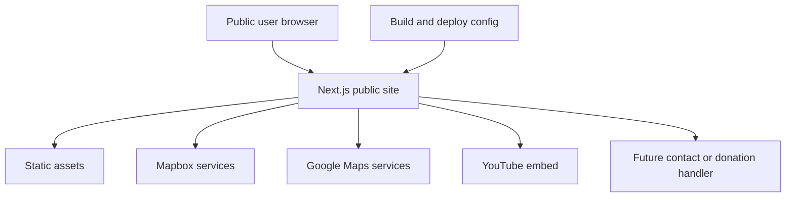

# Caritas Charities threat model

## Executive summary

The repository is a public Next.js 16/React 19 website for Caritas Kampala. It serves static content and client-side maps, gallery/lightbox behavior, analytics, external links, and a YouTube embed. The highest risks are public third-party API key abuse, content or dependency integrity compromise, browser-side injection if future content becomes dynamic, and abuse of any future contact/donation endpoint. No current authenticated or privileged application surface was found.

## Scope and assumptions

- In scope: `app/`, `components/`, `next.config.ts`, `package.json`, `package-lock.json`, public assets, and runtime third-party integrations.
- Out of scope: DNS/CDN/provider configuration, deployment IAM, payment provider dashboards, source-control permissions, and any backend not present in this repository.
- Assumed internet exposure: production site is publicly reachable over HTTPS.
- Assumed data sensitivity: public charity/programme content, office location, public phone numbers, and potentially user-submitted contact data if the form is later wired up.
- Assumed deployment: Next.js hosted behind a managed platform, with `NEXT_PUBLIC_MAPBOX_TOKEN` and possibly `NEXT_PUBLIC_GOOGLE_MAPS_API_KEY` supplied at build/runtime.
- No authentication, multi-tenancy, admin CMS, database, API route, upload endpoint, or server action was found.

Open questions that would change risk: Are the map keys restricted to the production origin? Is there an external form/payment backend not included here? Which deployment/CDN owns TLS, headers, logs, and rate limiting?

## System model

### Primary components

- Next.js App Router pages in `app/` and reusable React components in `components/`.
- Browser-side Mapbox integration in `components/Map.tsx`.
- An unused/alternate browser-side Google Maps loader in `components/GoogleMap.tsx`.
- Third-party YouTube privacy-enhanced iframe in `components/SpotlightSection.tsx`.
- Vercel Analytics and Speed Insights in `app/layout.tsx`.
- Static images, fonts, favicons, sitemap, and robots files under `public/`.

### Data flows and trust boundaries

- Internet user → Next.js site: HTTP(S) requests for public pages and assets; no application authentication or request schema enforcement is present.
- Build/deployment environment → browser bundle: `NEXT_PUBLIC_*` values are embedded for client use; they must be treated as public and provider-restricted.
- Browser → Mapbox: map style/tile/API requests using the public Mapbox token; provider-side origin/quota controls are required.
- Browser → Google Maps: alternate loader can place the public Google key in a script URL; provider referrer restrictions are required.
- Browser → YouTube: iframe loads a fixed external video; sandboxing and CSP now limit its embedding context.
- Browser → future contact handler: currently no network submission occurs; if added, untrusted text will cross into server/email systems and needs schema validation, CSRF/origin controls, rate limiting, and output encoding.

#### Diagram

## Assets and security objectives

| Asset | Why it matters | Security objective (C/I/A) |
|---|---|---|
| Public charity content and donation instructions | Misinformation could redirect donations or damage reputation | Integrity, availability |
| Mapbox/Google public API keys | Unrestricted keys can be abused for quota exhaustion or billing | Confidentiality of key scope, availability |
| Future contact submissions | May contain names, emails, phones, and sensitive enquiries | Confidentiality, integrity |
| Dependency lockfile and build artifacts | Compromised dependencies can alter every served page | Integrity |
| Third-party provider availability | Maps/video affect user trust and contact/directions flows | Availability |
| Deployment configuration and environment variables | Misconfiguration can expose secrets or weaken headers | Confidentiality, integrity |

## Attacker model

### Capabilities

- Anonymous internet user can request pages, inspect JavaScript, replay public URLs, and interact with browser integrations.
- Opportunistic attacker can scrape public content, attempt quota abuse against exposed provider keys, or submit spam if a future endpoint is added.
- Supply-chain attacker may target a compromised dependency or malicious update if dependency review is weak.
- Attacker may exploit a future content-management or form integration if it renders attacker-controlled data unsafely.

### Non-capabilities

- No evidence of authenticated accounts, admin routes, private API endpoints, database access, file upload, or server command execution in this repository.
- An attacker cannot be assumed to control deployment, DNS, provider dashboards, or the external donation/payment platform from this code alone.

## Entry points and attack surfaces

| Surface | How reached | Trust boundary | Notes | Evidence |
|---|---|---|---|---|
| Public App Router pages | Normal browser navigation | Internet → Next.js | Public content; no auth | `app/**/page.tsx` |
| Mapbox client | Contact page map | Browser → Mapbox | Public token and third-party requests | `components/Map.tsx:22-29` |
| Google Maps loader | Alternate map component | Browser → Google | Public key in script URL | `components/GoogleMap.tsx:30-38` |
| YouTube iframe | Spotlight modal | Browser → YouTube | Fixed external origin, now sandboxed | `components/SpotlightSection.tsx:120-130` |
| External links | Navigation, donations, social, directions | Browser → external sites | Redirect integrity and privacy boundary | `components/Navbar.tsx`, `components/Footer.tsx`, `app/contact-us/page.tsx` |
| Contact form | User fills and submits | Browser → currently nowhere | No handler today; future high-risk boundary | `app/contact-us/page.tsx:123-216` |
| Dependency/build pipeline | npm install/build | Developer/CI → artifact | Supply-chain trust boundary | `package.json`, `package-lock.json` |

## Top abuse paths

1. Attacker obtains a public Mapbox/Google key from the browser bundle → calls provider APIs from elsewhere → consumes quota or causes billing/availability impact.
2. Attacker compromises a dependency or build input → injects script/content into the static bundle → serves phishing or donation-redirection content to site visitors.
3. Future form attacker submits high-volume or oversized messages → exhausts provider/email resources → degrades service or causes spam delivery.
4. Future content editor stores HTML/URL data without schema validation → browser renders attacker-controlled markup → XSS, phishing, or account/session theft if authenticated features are later added.
5. Attacker abuses an unrestricted external redirect or incorrect donation URL → sends users to a lookalike destination → donation fraud and reputational harm.

## Threat model table

| Threat ID | Threat source | Prerequisites | Threat action | Impact | Impacted assets | Existing controls (evidence) | Gaps | Recommended mitigations | Detection ideas | Likelihood | Impact severity | Priority |
|---|---|---|---|---|---|---|---|---|---|---|---|---|
| TM-001 | Anonymous remote attacker | Public provider key is present and not origin restricted | Reuse Mapbox/Google key outside the site to consume quota | Billing, map outage, support burden | API keys, availability | Keys are environment-driven; `components/Map.tsx:26` | `NEXT_PUBLIC_*` is public; restriction not verifiable here | Restrict by origin/API, set quotas and alerts, rotate exposed keys | Provider quota/billing alerts by referrer and API | Medium | Medium | high |
| TM-002 | Supply-chain attacker | Malicious dependency/update reaches CI | Alter rendered bundle or build output | Site compromise, phishing, donation redirection | Content integrity, users | Lockfile and npm scripts exist | Audit was unavailable; no visible dependency scanning | Run npm audit/OSV/Snyk in CI, review lockfile diffs, pin trusted updates | Dependency alerts, artifact hash/signing, CSP violation reports | Low/medium | High | high |
| TM-003 | Future form spammer | Contact form is connected to a handler | Flood messages or submit maliciously large/encoded content | Email/provider exhaustion, operational abuse | Future contact pipeline | Browser required fields only at `app/contact-us/page.tsx:126-200` | No server validation, CSRF, rate limit, or CAPTCHA exists | Server-side schema/length limits, origin/CSRF checks, IP/user throttles, honeypot/CAPTCHA | 4xx rate, message volume, payload size, provider failures | High if enabled | Medium | high |
| TM-004 | Future content attacker | Attacker-controlled content reaches CMS/data source | Inject HTML/URL payload into rendered page | XSS, phishing, data theft if auth is later added | Users, content integrity | React escaping by default; no `dangerouslySetInnerHTML` found | No schema/sanitization boundary because no CMS exists | Validate schemas at ingestion, sanitize allowed rich text, safe URL allowlist, CSP nonces | CSP reports, suspicious markup/URL alerts | Low today | High if added | medium |
| TM-005 | Fraudster or compromised external destination | User trusts links shown by site | Replace/abuse donation/social/directions destination | Misrouted donations and reputational damage | Donation integrity, users | External links use `noopener` in reviewed areas | Destination ownership cannot be validated from code | Centralize/verify allowlisted destinations, monitor link changes, use signed deployment review | Link integrity checks and reports of redirects | Low/medium | High | high |
| TM-006 | Browser attacker | User visits from hostile embedding context | Frame site or abuse clickjacking | Misleading clicks or content integrity impact | User actions, reputation | `X-Frame-Options` and CSP `frame-ancestors` now set in `next.config.ts:12-26` | Deployment proxy must preserve headers | Verify headers at production edge; keep same-origin framing only if required | External header scan and CSP reports | Low | Medium | medium |

## Criticality calibration

- Critical: remote compromise of a privileged/admin surface, payment/data exfiltration, or an integrity compromise affecting all visitors. No current example was confirmed.
- High: provider-key abuse causing material billing/outage, supply-chain page compromise, future contact abuse, or donation redirection. TM-001, TM-002, TM-003, and TM-005 are examples.
- Medium: clickjacking or future stored-XSS exposure without a current privileged session, or third-party availability degradation. TM-004 and TM-006 are examples.
- Low: minor public metadata leakage or nuisance scraping with no sensitive state. No material current finding required this priority.

## Focus paths for security review

| Path | Why it matters | Related Threat IDs |
|---|---|---|
| `next.config.ts` | Browser headers, CSP, and remote image trust policy | TM-002, TM-006 |
| `components/Map.tsx` | Public Mapbox token and external map boundary | TM-001 |
| `components/GoogleMap.tsx` | Public Google key and dynamic script injection boundary | TM-001 |
| `app/contact-us/page.tsx` | Future PII collection and form abuse boundary | TM-003, TM-004 |
| `components/SpotlightSection.tsx` | Third-party iframe trust boundary | TM-002, TM-006 |
| `package.json` / `package-lock.json` | Dependency supply chain | TM-002 |
| `components/Navbar.tsx` / `components/Footer.tsx` | External redirects and sharing destinations | TM-005 |

## Notes on use

- This model assumes the repository is the complete runtime application. External payment, form, CMS, DNS/CDN, and deployment controls must be reviewed separately.
- Public API keys are not secrets; provider-side restrictions are the actual control.
- No authentication/session/authorization or upload controls are currently applicable because those surfaces were not found.
